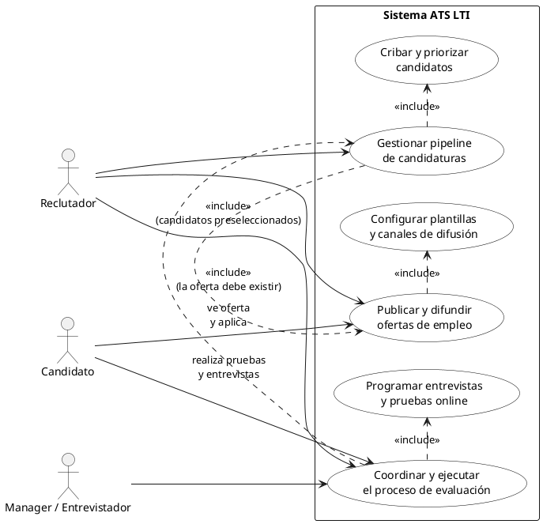
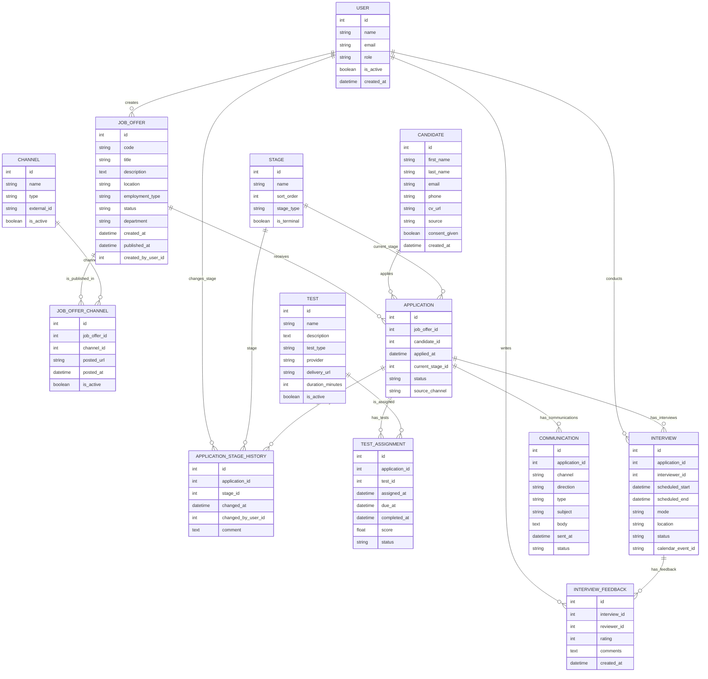
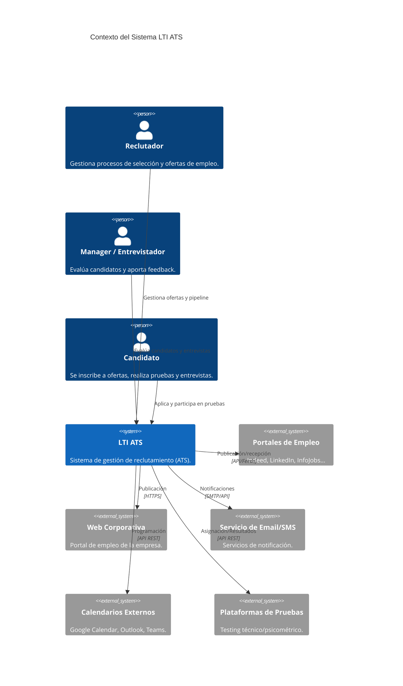
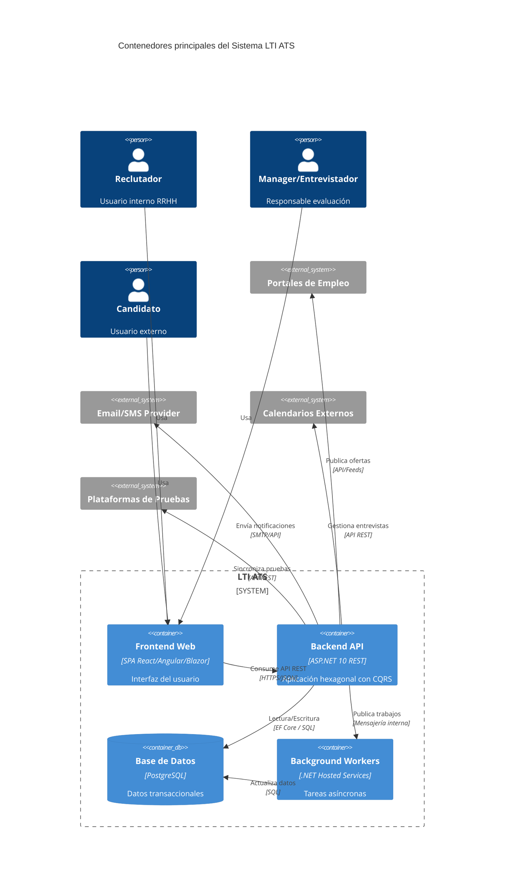

# LTI – Sistema ATS (Applicant Tracking System)

## Descripción Breve
**LTI** es un sistema ATS diseñado para digitalizar, centralizar y automatizar todo el ciclo de reclutamiento. Permite gestionar ofertas de empleo, recibir y clasificar candidaturas, coordinar entrevistas y seleccionar a los candidatos ideales mediante un flujo estructurado, intuitivo y completamente trazable.

---
## Valor Añadido
- **Automatiza procesos manuales** reduciendo tiempo y esfuerzo en actividades repetitivas del área de RRHH.  
- **Mejora la experiencia del candidato** gracias a una comunicación clara y un proceso más fluido.  
- **Aporta visibilidad completa** del pipeline de contratación para reclutadores y managers.  
- **Facilita decisiones basadas en datos** mediante analíticas de rendimiento del proceso y calidad de las contrataciones.  
- **Reduce tiempos de contratación (Time-to-Hire)** y aumenta la calidad del talento incorporado.

---
## Ventajas Competitivas
- **Flujo configurable** para adaptarse a distintos procesos de selección según rol o departamento.  
- **Integración con portales de empleo**, redes sociales y páginas corporativas sin esfuerzo.  
- **Motor de cribado automático** basado en criterios, palabras clave, y ranking inteligente de candidatos.  
- **Panel de control unificado** para reclutadores, con alertas y tareas pendientes.  
- **Colaboración multiusuario**, permitiendo a managers y entrevistadores evaluar directamente en el sistema.  
- **Escalabilidad** para equipos de RRHH de cualquier tamaño.  
- **Cumplimiento legal** en protección de datos (GDPR) y gestión del consentimiento del candidato.  

---
## Funciones Principales del Sistema
A continuación se detallan las funcionalidades básicas representadas en la imagen y otras adicionales necesarias en un ATS moderno:

### 1. Creación de Puestos de Trabajo
- Definir rol, requisitos, competencias y criterios de selección.  
- Crear plantillas reutilizables para agilizar futuros procesos.  

### 2. Publicación de Ofertas
- Publicación automática en:
  - Portales de empleo
  - Web corporativa
  - Redes sociales
- Difusión multicanal y seguimiento del rendimiento de cada canal.

### 3. Recepción de Candidaturas
- Recogida centralizada de todas las aplicaciones.  
- Importación automática y manual de CVs.  
- Captura de metadatos y conversión del CV gracias a parsing inteligente.

### 4. Revisión y Clasificación de Candidatos
- Vista en pipeline por etapas.  
- Filtros avanzados por habilidades, experiencia o palabras clave.  
- Ranking automático según criterios definidos.  

### 5. Pruebas Online
- Envío de pruebas técnicas, psicométricas o cuestionarios personalizados.  
- Integración con plataformas externas de test.  
- Resultados en tiempo real vinculados al perfil del candidato.

### 6. Programación de Entrevistas
- Calendario integrado.  
- Sincronización con Google Calendar, Outlook o Teams.  
- Envío automático de invitaciones y recordatorios.

### 7. Evaluación de Entrevistas
- Formularios de evaluación para entrevistadores.  
- Notas internas y puntuaciones estandarizadas.  
- Comparación de perfiles de candidatos.

### 8. Selección y Contratación
- Gestión del candidato finalista.  
- Envío de oferta laboral directamente desde el sistema.  
- Registro del estado de aceptación y firma digital (si aplica).

### 9. Comunicación Automática con Candidatos
- Emails automáticos personalizados por etapa.  
- Confirmaciones de recepción, actualización del estado, agradecimientos.  

### 10. Analítica y Reportes
- Métricas clave:  
  - Time-to-Hire  
  - Coste por contratación  
  - Conversión por etapa del pipeline  
- Informes de rendimiento para RRHH y managers.  

### 11. Gestión de Base de Datos de Talento
- Creación de un Talent Pool dinámico.  
- Etiquetado de candidatos para futuras oportunidades.  
- Búsqueda avanzada en toda la base de datos histórica.

### 12. Cumplimiento Legal (GDPR)
- Gestión de consentimientos.  
- Políticas de retención de datos.  
- Eliminación automática de perfiles inactivos.

---
# Lean Canvas – Sistema ATS LTI

## 1. Problema
- Procesos de selección lentos, manuales y poco eficientes.  
- Dificultad para centralizar candidaturas provenientes de múltiples canales.  
- Falta de visibilidad del pipeline de selección para reclutadores y managers.  
- Comunicación inconsistente con los candidatos.  
- Falta de criterios objetivos y comparables entre candidatos.  
- Uso de herramientas desconectadas (Excel, correo, portales externos).

## 2. Segmentos de Clientes
- **Departamentos de Recursos Humanos** de medianas y grandes empresas.  
- **Startups en crecimiento** con necesidad de escalar procesos de contratación.  
- **Empresas de reclutamiento** y headhunters.  
- **Organizaciones con contratación recurrente** (retail, call centers, hostelería).  
- **Administraciones o entidades públicas** con procesos de selección estructurados.

## 3. Propuesta Única de Valor
> **“Un ATS que automatiza, optimiza y centraliza todo el proceso de selección, reduciendo significativamente el tiempo y coste de contratación mientras mejora la experiencia del candidato.”**

- Flujo completamente trazable.  
- Colaboración sencilla entre reclutadores y managers.  
- Motor de cribado y ranking inteligente.  
- Integración total con portales de empleo y herramientas externas.  
- Analítica para decisiones basadas en datos.

## 4. Solución
- Creación y publicación automática de ofertas.  
- Recepción y parsing inteligente de CVs.  
- Pipeline visual para gestionar etapas del proceso.  
- Cribado automático basado en criterios y palabras clave.  
- Tests online integrados y evaluación centralizada.  
- Entrevistas programadas con integración de calendario.  
- Comunicación automatizada con candidatos.  
- Analítica avanzada e informes personalizables.  
- Cumplimiento GDPR y gestión de consentimientos.  
- Talent Pool y reutilización de candidatos.

## 5. Canales
- Página web corporativa y demostración online.  
- SEO/SEM dirigido a empresas con alta demanda de contratación.  
- Equipos comerciales B2B con demos personalizadas.  
- Marketplace de integraciones HR (Google, LinkedIn, Indeed).  
- Asociaciones de RRHH, ferias y eventos sectoriales.

## 6. Métricas Clave (KPIs)
- **Time-to-Hire** (duración del proceso de contratación).  
- **Número de contrataciones gestionadas por reclutador**.  
- **Conversión por etapa del funnel**.  
- **Coste por contratación**.  
- **Satisfacción del candidato** (NPS).  
- **Uso del Talent Pool** y reciclaje de candidatos.  
- **Adopción del sistema** (usuarios activos, uso de funcionalidades).

## 7. Estructura de Costes
- Desarrollo y mantenimiento del software.  
- Infraestructura en la nube (servidores, almacenamiento, seguridad).  
- Equipo de soporte y Customer Success.  
- Marketing digital y ventas.  
- Integraciones con plataformas externas.  
- Actualizaciones, compliance y certificaciones.

## 8. Flujo de Ingresos
**Modelo SaaS basado en suscripción**, con diferentes tiers según necesidades:

### Planes posibles
- **Basic**: gestión de ofertas, pipeline, publicación básica.  
- **Pro**: tests online, automatizaciones, reportes avanzados.  
- **Enterprise**: integraciones, SSO, soporte premium, analítica avanzada.  

### Otros ingresos complementarios
- **Onboarding y formación inicial**.  
- **Servicios profesionales** (configuración avanzada, personalizaciones).  
- **Módulos adicionales** (IA de matching, firma digital, entrevistas por vídeo).  
- **Marketplace de integraciones** con fee por partner.

## 9. Ventaja Competitiva
- Sistema flexible, personalizable y escalable.  
- Integración profunda con portales de empleo y ecosistema HR.  
- Motor de cribado basado en IA para reducir drásticamente el tiempo de revisión.  
- Experiencia del candidato mejorada mediante comunicación automática.  
- Analítica completa y adaptable a cada organización.  
- Cumplimiento legal garantizado (GDPR), reduciendo riesgos.  
- Talent Pool inteligente, reutilizando candidatos y reduciendo costes futuros.

---
# Casos de Uso Principales del Sistema LTI

## 1. **Publicación y Difusión de Ofertas de Empleo**
### Descripción Detallada
El reclutador crea una nueva oferta de empleo definiendo título, requisitos, competencias y criterios de evaluación. El sistema LTI permite publicar automáticamente esta oferta en múltiples canales: portales de empleo, página web corporativa y redes sociales.  
El proceso incluye la utilización de plantillas predefinidas, la selección de canales óptimos y el seguimiento del rendimiento de cada fuente de candidatos.  
El objetivo es maximizar la visibilidad de la oferta y alcanzar el mayor número posible de candidatos cualificados, reduciendo el tiempo necesario para difundirla manualmente en cada plataforma.

## 2. **Gestión del Pipeline de Candidaturas**
### Descripción Detallada
Cuando los candidatos aplican, el sistema centraliza todas las solicitudes y utiliza un motor de parsing para extraer información del CV de forma automática.  
Posteriormente, el reclutador visualiza todas las candidaturas en un pipeline por etapas (recibido, revisión, prueba, entrevista, oferta, contratación).  
El sistema permite:
- Filtrar candidatos por experiencia o habilidades.
- Clasificarlos según su adecuación mediante un ranking inteligente.
- Añadir notas internas y evaluaciones.
- Realizar movimientos masivos entre etapas.

Este caso de uso constituye el núcleo operativo del ATS, ya que organiza y prioriza el flujo de selección, ahorrando tiempo y aumentando la eficacia del proceso.

## 3. **Coordinación y Ejecución del Proceso de Evaluación**
### Descripción Detallada
Una vez identificados los candidatos preseleccionados, el sistema LTI permite gestionar todo el proceso evaluativo:  
- Envío de pruebas online (técnicas, psicométricas o personalizadas).  
- Programación de entrevistas integrada en un calendario sincronizado con Google o Outlook.  
- Envío de recordatorios automáticos a candidatos y evaluadores.  
- Registro de evaluaciones estandarizadas y notas internas.  
- Comparación de resultados entre candidatos.

Este caso de uso garantiza que todas las interacciones evaluativas estén centralizadas, estructuradas y documentadas, permitiendo una selección final basada en criterios objetivos y colaborativos.

---
# Diagrama UML de Casos de Uso

## Cómo interpretarlo
- **Actores**
  - **Reclutador**: interactúa con los 3 casos de uso principales.
  - **Manager / Entrevistador**: participa en la evaluación.
  - **Candidato**: ve las ofertas, aplica e interactúa con pruebas/entrevistas.

- **Casos de uso principales**
  1. Publicar y difundir ofertas de empleo  
  2. Gestionar pipeline de candidaturas  
  3. Coordinar y ejecutar el proceso de evaluación  

- **Relaciones**
  - UC2 incluye a UC1: para gestionar un pipeline, primero debe existir una oferta.
  - UC3 incluye a UC2: la evaluación se ejecuta sobre candidatos ya organizados.
  - Casos de uso adicionales detallan tareas específicas como plantillas, cribado o programación de entrevistas.

---

# Modelo de Datos – Mermaid (ER Diagram)

## Explicación del Modelo de Datos

- **Publicación de ofertas**: JOB_OFFER, CHANNEL y JOB_OFFER_CHANNEL permiten publicar ofertas en múltiples canales.
- **Gestión del pipeline**: APPLICATION, STAGE y APPLICATION_STAGE_HISTORY administran el flujo de cada candidato.
- **Evaluación**: TEST, TEST_ASSIGNMENT, INTERVIEW y INTERVIEW_FEEDBACK gestionan pruebas y entrevistas.
- **Comunicación**: COMMUNICATION registra emails, SMS o llamadas automáticas/manuales.

---

# Modelo del Sistema (Arquitectura a Alto Nivel)

## 1. Visión General de la Arquitectura
El sistema LTI se basa en los siguientes principios arquitectónicos:
- **Arquitectura Hexagonal (Ports & Adapters)**
- **Backend .NET 10**
- **Frontend separado**, consumiendo API REST
- **CQRS** (Command Query Responsibility Segregation)
- **ORM Entity Framework** sobre **PostgreSQL**

El sistema se estructura como un monolito modular preparado para evolucionar a microservicios si es necesario.

---

## 2. Bounded Contexts Principales

### **1. JobManagement**
- Gestión de ofertas de empleo, plantillas y canales.
- Publicación automática en portales de empleo.

### **2. Candidate & Application Management**
- Gestión de candidatos, candidaturas y pipeline.
- Integración con servicios de parsing de CV.

### **3. Assessment & Testing**
- Gestión de pruebas técnicas, psicométricas y cuestionarios.
- Asignación y recepción de resultados.

### **4. Interview Scheduling**
- Programación de entrevistas con integración de calendarios externos.
- Gestión de feedback de entrevistadores.

### **5. Communication**
- Envío automático y manual de emails, SMS y notificaciones.
- Plantillas configurables por etapa del proceso.

### **6. Analytics & Reporting**
- KPIs avanzados: Time-to-Hire, conversiones, coste por contratación.
- Vistas optimizadas para análisis.

### **7. Compliance & GDPR**
- Consentimientos, retención, anonimización y borrado seguro.

---

## 3. Arquitectura Hexagonal

### **Dominio (Core Business)**
- Entidades y agregados: JobOffer, Candidate, Application, Stage, Test, Interview, Communication.
- Value Objects y políticas de dominio.
- Domain Services: reglas de pipeline, políticas GDPR, reglas de publicación.

### **Aplicación (Use Cases)**
- **Command Handlers** para operaciones que mutan el estado.
- **Query Handlers** para operaciones de lectura optimizadas.
- Interfaces (Ports) para repositorios y servicios externos.

### **Adaptadores de Entrada (Inbound Adapters)**
- **Controllers REST (ASP.NET)**  
- **Background Jobs** para tareas programadas (recordatorios, borrado según GDPR)

### **Adaptadores de Salida (Outbound Adapters)**
- Repositorios EF Core → PostgreSQL
- Integraciones externas:
  - Portales de empleo
  - Email/SMS providers
  - Calendarios (Google/Outlook)
  - Plataformas de pruebas

---

## 4. CQRS: Separación de Lectura y Escritura

### **Write Side (Commands)**
Operaciones que generan cambios:
- Crear/Editar/ Publicar ofertas
- Crear candidaturas
- Mover etapas de pipeline
- Asignar pruebas
- Programar entrevistas
- Enviar comunicaciones
- Contratar/Rechazar candidatos

Commands → CommandHandlers → Repositorios/Servicios externos.

### **Read Side (Queries)**
Consultas optimizadas:
- Pipeline por oferta/etapa
- Historial de candidatos
- Tests y entrevistas pendientes
- Dashboard de KPIs

Queries → QueryHandlers → Read Models (vistas optimizadas o proyecciones SQL)

---

## 5. Frontend

- SPA moderna (React / Angular / Blazor)
- Módulos alineados con dominios:
  - Jobs
  - Applications
  - Pipeline
  - Assessments
  - Interviews
  - Communications
  - Reporting
- Autenticación mediante tokens (JWT u otra)

---

## 6. Relación entre Funciones y Componentes del Sistema

| Función del Sistema | Bounded Context | Componentes Principales |
|---------------------|----------------|--------------------------|
| Creación de Puestos | JobManagement | Commands + Repositorio EF |
| Publicación | JobManagement + Integrations | Publisher Ports |
| Recepción de Candidaturas | Candidate & Application | CV Parser + Commands |
| Clasificación | Candidate & Application | Ranking Service + Pipeline Rules |
| Pruebas Online | Assessment & Testing | Test Provider Adapter |
| Entrevistas | Interview Scheduling | Calendar Adapter |
| Evaluación | Interview Scheduling | Feedback Handlers |
| Contratación | Candidate & Application | Hire/Reject Commands |
| Comunicación | Communication | Email/SMS Adapters |
| Analítica | Reporting | Read Models SQL |
| Base de Talento | Candidate & Application | Candidate Repository |
| GDPR | Compliance & GDPR | Background Jobs + Policies |

---

---

# Diagramas C4 en Mermaid

## 1. C4 – Diagrama de Contexto (System Context)

## 2. C4 – Diagrama de Contenedores (Container Diagram)

